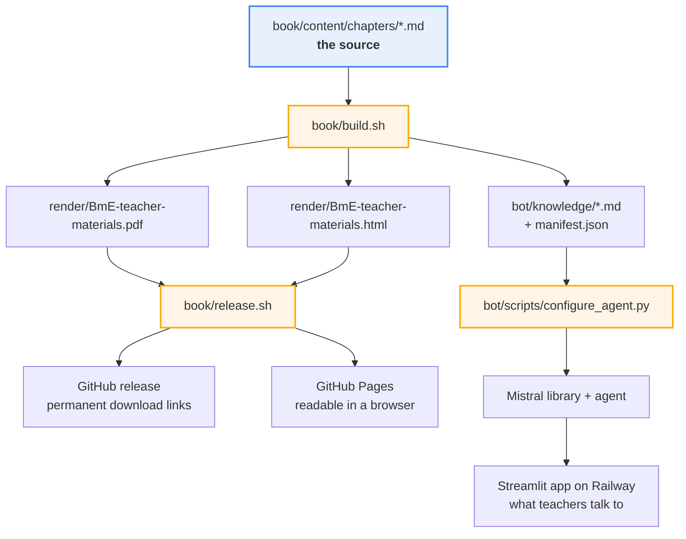

# Building and releasing

How the pieces of this repository fit together, and what to type. Written to be read cold, months
later, when you have forgotten all of it.

## The shape of the thing

There is **one source of truth** — the markdown in `book/content/chapters/` — and **three things
built from it**:

| Artifact | Made by | Read by |
| :--- | :--- | :--- |
| the PDF | `book/build.sh` | teachers, on paper and on screen |
| the single-file HTML | `book/build.sh` | teachers, in a browser |
| `bot/knowledge/` | `book/build.sh`, then pushed by `bot/scripts/configure_agent.py` | the teacher-support bot |

That is the whole design, and the reason for it is the one failure worth preventing: a teacher being
told something by the bot that the PDF in their hand contradicts. Edit a chapter and all three move
together, or none of them do.



The three shaded boxes in the middle are the only commands you ever need to run. Everything else is a
consequence of them.

## The three things you can do

### 1. Edit and see the result

```sh
cd book
./build.sh
```

Two or three minutes. Produces `render/BmE-teacher-materials.pdf` and `.html`, regenerates
`bot/knowledge/`, and reports what is wrong: revision notes still outstanding, links that do not
resolve, mBlock programs without a local copy.

Nothing is published. Run it as often as you like.

> **The tree is dirty afterwards, always.** `bot/knowledge/` is tracked and gets rewritten by every
> build, so `git status` is never clean straight after one. That is expected — see *A build always
> dirties the tree* below.

### 2. Update the bot

```sh
cd book && ./build.sh                              # regenerate bot/knowledge/
cd ..
python bot/scripts/configure_agent.py --dry-run    # what would change
python bot/scripts/configure_agent.py              # do it
python bot/scripts/test_agent.py                   # ask it something
```

`configure_agent.py` deletes every document in the Mistral library and re-uploads, because uploading
is not idempotent: run it twice without the delete and the library holds two copies of every chapter,
and the bot answers from two editions at once. It also sends the agent's instructions
(`bot/instructions.md`), its model, temperature and reasoning effort, and stamps the edition and git
fingerprint into the agent's metadata, so a deployed agent can be traced back to what it was built
from.

`test_agent.py` prints the documents behind every answer, and that is the point of it. The failure
that matters is a confident answer drawn from the model's own knowledge of mBot rather than from
these materials — it reads exactly like a good answer. An answer with **no** sources is the shape
that failure takes.

**The app needs no deploy for this.** Railway runs the Streamlit front end; the knowledge lives in
Mistral. Changing what the bot knows does not touch the app. Changing the app's *code* does — push to
`main` and Railway redeploys.

### 3. Publish an edition

```sh
cd book
./release.sh v1.0 --dry-run   # build, check everything, publish nothing
./release.sh v1.0             # the real thing; asks before anything goes public
```

Do the dry run first, open the PDF, check the footer reads `v1.0` and there is no red *do not
distribute* box on the cover. Then run it properly.

Afterwards, point the bot at the edition you just published:

```sh
python bot/scripts/configure_agent.py
```

Release first, agent second. The release commits a knowledge set stamped with the tag; running the
agent script beforehand would push one stamped `-stale`.

## The permanent links

These never change, so they can be shared once and left alone:

```
read in a browser  https://dvanderelst.github.io/bme_teacher_resources/
download the PDF   https://github.com/dvanderelst/bme_teacher_resources/releases/latest/download/BmE-teacher-materials.pdf
download the HTML  https://github.com/dvanderelst/bme_teacher_resources/releases/latest/download/BmE-teacher-materials.html
```

The download links work because GitHub redirects `releases/latest/download/<filename>` to whatever
the newest release holds. **The redirect is keyed on the file name** — the one thing here that must
never change. Rename an artifact and every link already handed out dies.

Both of those are downloads and cannot be anything else: GitHub stamps every release asset
`content-disposition: attachment`, deliberately, so nobody can host arbitrary HTML and JavaScript on
github.com. The Pages copy exists to be the link that simply opens.

## Cutting a release, step by step

The order is not arbitrary. Each step exists because the obvious ordering produces a document that
lies about itself.

**1. Refuse to build anything ambiguous.** On `main`, clean tree, in sync with `origin`, tag not
already taken. Every one of those is a way to ship bytes that do not match the version printed on
them — the one failure a teacher cannot see or report usefully.

**2. Build with the tag passed in.** `build.sh` normally derives the version from `git describe`, but
at this point the tag does not exist: it is created in step 4, on a commit that does not exist yet
either. So `release.sh` passes `BME_FINGERPRINT=v1.0`.

The override is applied *after* `build.sh` has tested the tree for uncommitted changes. Renaming a
build cannot silence the "do not distribute" cover.

Handout links are pinned here too. Day to day `BME_FILE_BASE` points at `main`, so links track the
latest content; a release repoints it at the tag, freezing them to the content that edition was built
from.

**3. Commit the regenerated knowledge set.** Committed *before* tagging, so the tag covers the bot's
copy of the edition as well. `release.sh` checks that `bot/knowledge/` is the only thing the build
touched, and stops if anything else changed.

**4. Tag, push, publish.** The tag lands on the knowledge commit. Then `main` and the tag are pushed,
the release is created with both files attached, and the HTML goes to `gh-pages` as a parentless,
force-pushed commit — no history, so each release makes the previous 20 MB copy unreachable instead
of stacking another on top.

## Where the version numbers come from

Two different things, both printed in the PDF footer and on the title page:

- **Edition** — a human-facing date, taken from the date of the last commit. Nothing to bump.
- **Fingerprint** — `v1.0` on a release; on a local build, the nearest tag plus a short commit hash,
  with `-stale` appended when the tree has uncommitted changes.

So any file anyone sends you can be traced back to a commit, and a development build can never be
mistaken for a released one. The same pair goes into `bot/knowledge/manifest.json`, which is how you
answer "which edition is the bot serving?".

## Things that will bite you

**A build always dirties the tree.** `bot/knowledge/` is tracked and regenerated every time, so
`git status` is never clean after a build. Worse, those files embed the file base *in every image
link*: an ordinary build writes `raw/main/…`, a release build writes `raw/v1.0/…`. So the first
ordinary build after a release reverts all of them and it looks like something has gone wrong. It has
not. Leave it, or `git checkout -- bot/knowledge` to tidy up. `release.sh --dry-run` restores it for
you.

**Streamlit must be started from `bot/`.** It reads `.streamlit/config.toml` from the directory it is
started in, so `cd bot && streamlit run app/app.py` gets the dark theme and starting it from the
repository root comes up light. Railway does this by having the service's **Root Directory set to
`bot`**, which is also why it finds `requirements.txt` at all.

**A new environment variable must be added to `KNOWN_KEYS`** in `bot/lib/settings.py`. The
environment is overlaid by name, and there is no `.env` on Railway to learn the names from, so a key
missing from that list works locally and is silently ignored in production. Currently:
`MISTRAL_API_KEY`, `AGENT_ID`, `MISTRAL_LIBRARY_ID`, `DATABASE_URL`.

**`bot/users.txt` is the whole account list, not a log.** `set_users.py` deletes every account and
rewrites it from the file, so "who has access?" is answered by reading one file. It holds plaintext
passwords and is gitignored.

**The database is Postgres in production, SQLite locally.** `read_feedback.py` prints which one it
opened before anything else, because an empty list means very different things depending on the
answer.

**`gh-pages` is generated.** Never edit it. It is force-pushed with no history on every release.

## Everyday tasks

| I want to… | Do this |
| :--- | :--- |
| change a chapter | edit `book/content/chapters/*.md`, then `cd book && ./build.sh` |
| see what still needs doing | `python3 book/tools/notes.py` |
| find text that runs off the page | `book/tools/check-overfull.sh` |
| check links and mBlock mirrors | `python3 book/tools/check-links.py` |
| tidy paragraph wrapping | `python3 book/tools/unwrap.py` |
| redraw a figure we drew | edit `book/content/images/src/*.svg`, then `book/content/images/src/render.sh` |
| change how the bot behaves | edit `bot/instructions.md`, then `python bot/scripts/configure_agent.py` |
| change the bot's model or temperature | edit the constants at the top of `bot/scripts/configure_agent.py`, then run it |
| add or remove a teacher account | edit `bot/users.txt`, then `python bot/scripts/set_users.py` |
| read what teachers reported | `python bot/scripts/read_feedback.py` |
| ask the deployed bot something | `python bot/scripts/test_agent.py` |
| publish a new edition | `cd book && ./release.sh vX.Y` |

## When something goes wrong

**"tag vX.Y already exists".** Tags are cheap, releases are public; do not reuse one. Move to the next
version. If the tag was a genuine mistake and nothing was published from it,
`git tag -d vX.Y && git push origin :refs/tags/vX.Y`.

**"working tree has uncommitted changes".** Deliberate. Commit or stash. A release built from
uncommitted work cannot be reproduced from its tag.

**"main and origin/main have diverged".** Pull or push first, or the tag points at a commit nobody
else can see.

**The GitHub CLI is not installed.** `release.sh` does everything except the final publish, then
prints the two ways to finish: install `gh`, or drag the files onto the releases page and pick the
already-pushed tag.

**The Pages copy shows the old edition.** Give it a minute or two;
`gh api repos/dvanderelst/bme_teacher_resources/pages --jq .status` says `building` or `built`. If the
push itself failed, `release.sh` says so and carries on — the release is fine, only the readable copy
lags.

**A bad release is already published.** Do not delete it and re-upload under the same tag: `latest`
breaks for as long as no release exists, and anyone who downloaded in between holds a file whose
version number now means something else. Release the fix as the next version. The old release stays
up, which is the honest outcome.

**A release must actually come down** (wrong licence, an image you cannot distribute). Delete the
release on GitHub; `latest` falls back to the previous one, so the link keeps working rather than
404-ing. Then publish a corrected version.

**The bot is answering from an old edition.** Check the fingerprint in `bot/knowledge/manifest.json`,
then re-run `configure_agent.py`. If answers cite no sources at all, that is the failure
`test_agent.py` exists to catch: the model answering from its own knowledge of mBot rather than from
the library.

## The website

biologymeetsengineering.org runs on Wix, which cannot usefully host a 20 MB single-file document. The
clean arrangement is for it to link the three permanent addresses above rather than host copies that
fall a version behind. Wix's HTML embed element points an iframe at an external URL and the Pages
address is exactly that — though an embedded 20 MB page is slow on a school connection, and Wix's
embed is a fixed-height box that scrolls internally, which reads poorly on a phone. Linking out may
simply be better than embedding; look at it before deciding.

## Why the build is not automated

A GitHub Actions workflow could build on every `v*` tag, and one day it may be worth it. Not yet: the
PDF depends on a specific xelatex, a specific TeX package set and the DejaVu fonts, and reproducing
that in a container is a day's work whose output shifts if you get it slightly wrong. For a document
released a few times a year on a machine that already renders it correctly, the local script is the
better trade. Revisit if releases are ever cut by more than one person.

## The file map

```
book/
├── content/chapters/     THE SOURCE. Edit these.
├── content/images/       figures; src/ holds the SVGs we drew, and render.sh
├── content/files/        handouts, media, .mblock programs
├── build.sh              chapters -> PDF, HTML, bot/knowledge
├── release.sh            build, tag, push, publish, Pages
└── tools/                notes, links, overfull, unwrap, knowledge

bot/
├── app/app.py            the Streamlit app teachers use
├── lib/                  agent, auth, db, moderation, settings
├── instructions.md       the agent's system prompt — behaviour only, no facts
├── knowledge/            GENERATED by build.sh. Do not hand-edit.
├── scripts/              configure_agent, test_agent, set_users, read_feedback
└── railway.toml          deployment; the service's Root Directory must be `bot`

gh-pages (branch)         generated, no history, force-pushed on every release
```
